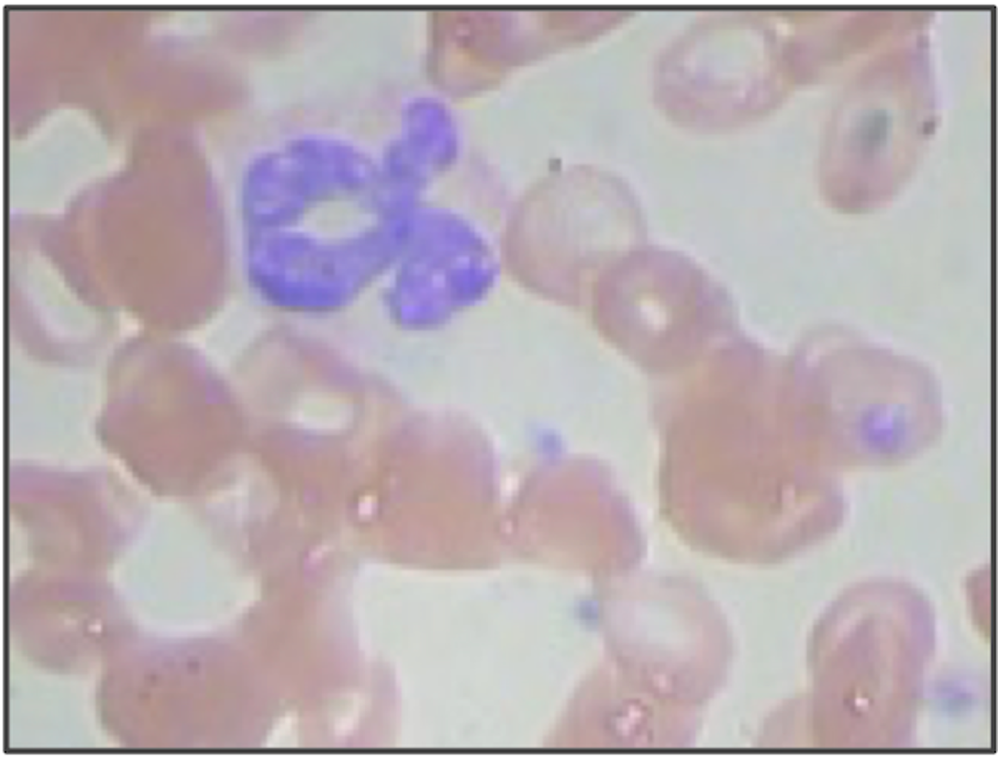
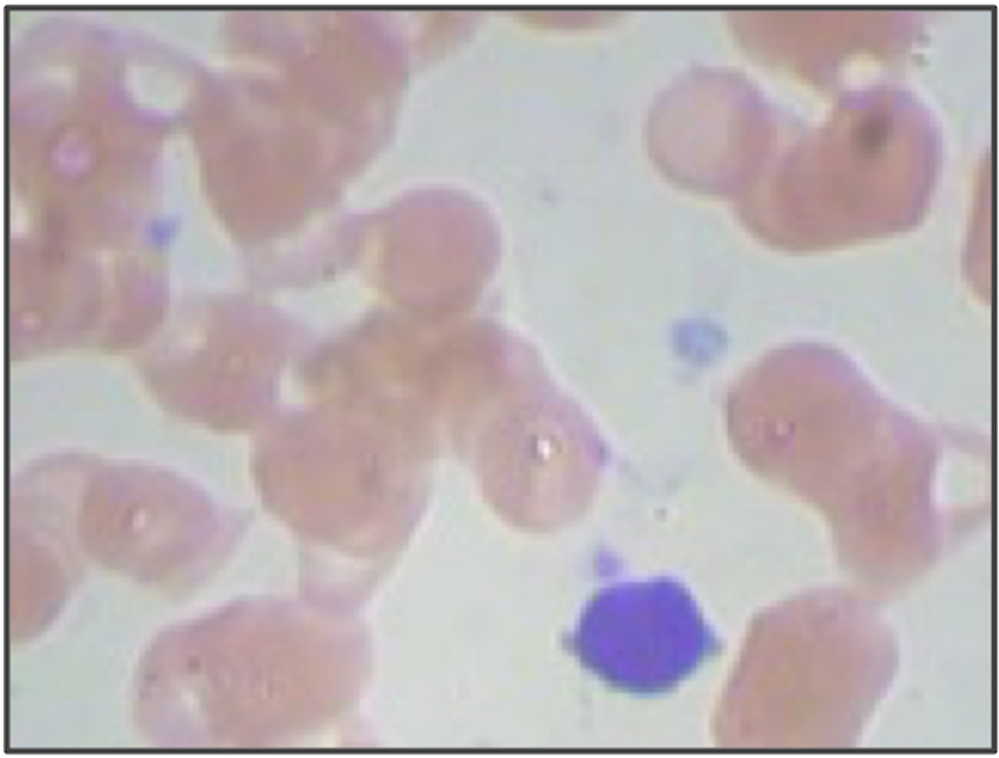
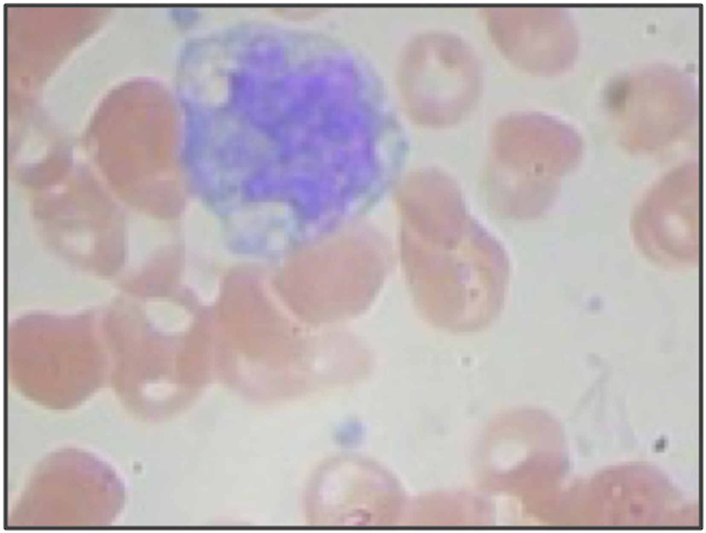

# Phase3-Project-WBC

# White Blood Cell Identification
## Background
In a complete blood count, a technician manually observes a blood sample underneath a microscope, and counts the number of white blood cells in the sample.  This project seeks to automate this process.  Provided an image of a blood sample, with the white blood cells stained a blue-ish color, the project seeks to identify the family type of the blood cell.

Each family type has a defining shape:  
Granulocyte:  
   
Monocyte:  
   
Lymphocyte:  
   

### Study Question
Can a simple computer vision algorithm classify white blood cell family types at a satisfactory rate?

### Results
KNN Classifier Results (Best)
- **Granulocytes**: Precision: 85% Accuracy: 71%
- **Monocytes**: Precision: 20% Accuracy: 28%
- **Lymphocytes**: Precision: 10% Accuracy: 33%

## Data Preparation
Begin by defining a new class, Contour, that will help to manage the data input and vectorization process.  Display one image from a test Contour object.

Vectorize each cell.  To do so:
- Read in the image, pull out the contour, and compare the contour to the first cell.
The comparison between each cell and the first one, "the distance," will be used to vectorize the images.

Load the names of each WBC and merge the data sets.

## Logistic Regression  
Run a logistic regression on the data, using a train test split.  Check the confusion matrix.

## KNN Classifier
Run a KNN Classifier on the data, using a train test split.  Check the confusion matrix.

# Results
KNN Classifier Results (Best)
- **Granulocytes**: Precision: 85% Accuracy: 71%
- **Monocytes**: Precision: 20% Accuracy: 28%
- **Lymphocytes**: Precision: 10% Accuracy: 33%